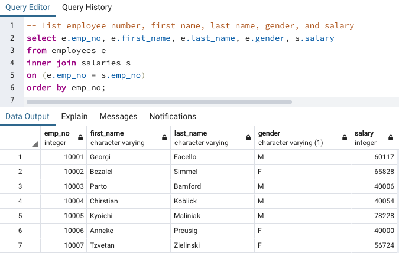
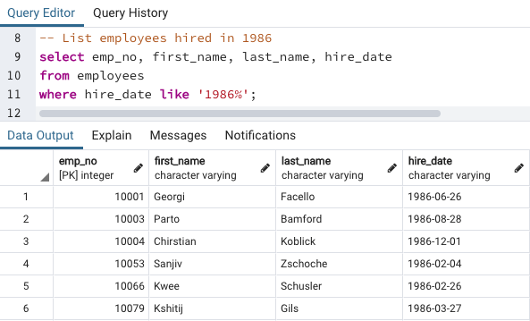
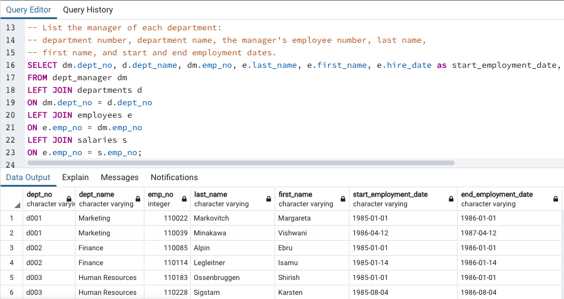
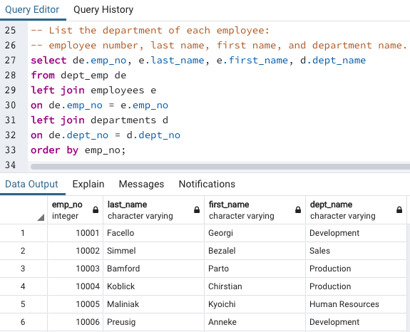
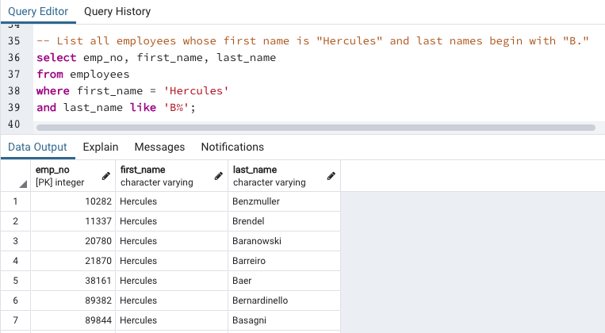
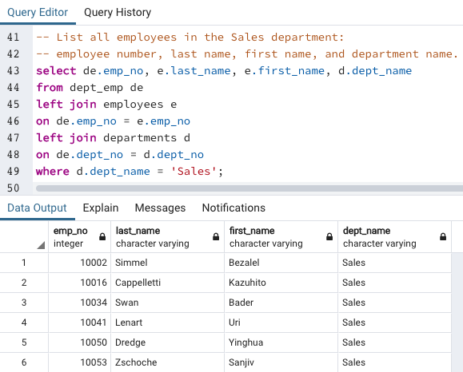
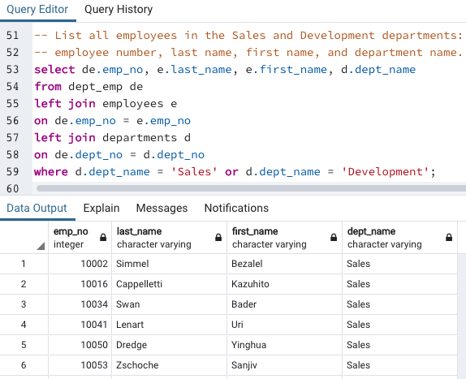
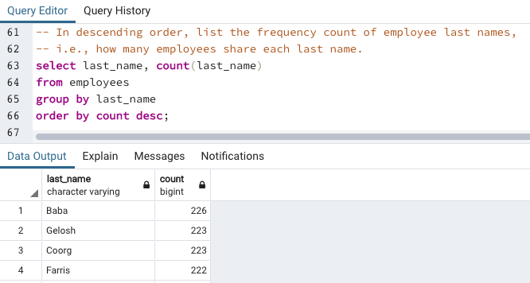
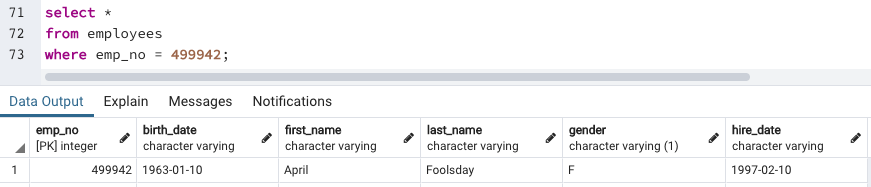

# Employee Database: A Mystery in Two Parts

## Background
I have been tasked to investigate employees of Pewlett Hackard from the 1980s and 1990s. All that remain of the database of employees from that period are six CSV files.

## Data Modeling
First the CSVs were inspected and an ERD sketch of the tables was made using http://www.quickdatabasediagrams.com.

## Data Engineering
A table schema for each of the six CSV files was created using the ERD as a base. For each file I had to specify data types, primary keys, foreign keys, and other constraints. Next I imported each CSV file into the corresponding SQL table.

## Data Analysis
Once I had a complete database I wanted to create the following queries to get a better understanding of the data.

1) Employee number, last name, first name, gender, and salary.

2) List employees who were hired in 1986.

3) List the manager of each department with the following information: department number, department name, the manager's employee number, last name, first name, and start and end employment dates.

4) List the department of each employee with the following information: employee number, last name, first name, and department name.

5) List all employees whose first name is "Hercules" and last names begin with "B."

6) List all employees in the Sales department, including their employee number, last name, first name, and department name.

7) List all employees in the Sales and Development departments, including their employee number, last name, first name, and department name.

8) In descending order, listed the frequency count of employee last names, i.e., how many employees share each last name.

9) Searched ID number 499942.

As I examined the data, I had a suspicion that the dataset is fake. I decided to import the SQL database into Pandas using SQLAlchemy and created the following charts: 

Histogram to visualize the most common salary ranges for employees.

Bar chart of average salary by title.

